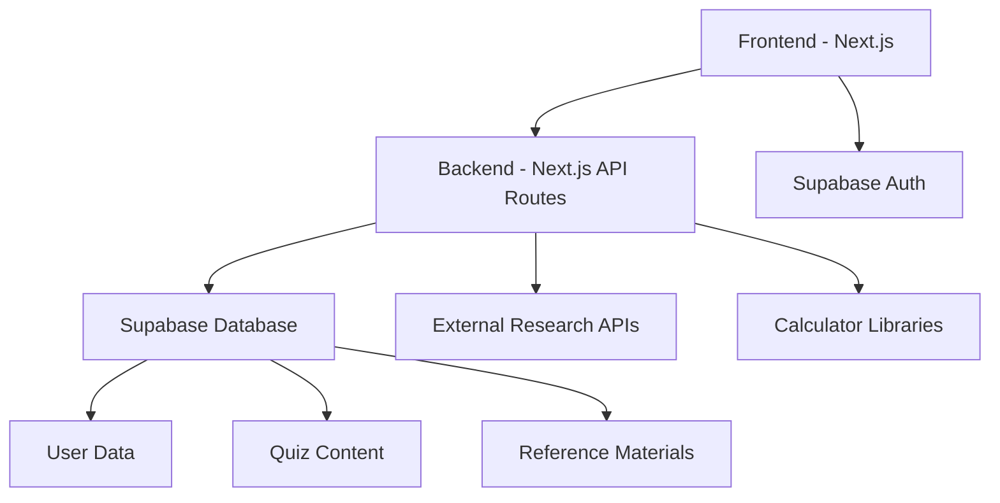

# Educational App for 12-Year-Old: Architecture & Development Plan

## Project Overview
This document outlines the architecture and development plan for an educational web application designed for a 12-year-old student. The app will feature three main components: Knowledge Testing (Quizzes), Research Discovery, and Calculator & Reference tools, all with gamification elements to make learning engaging.

## Target Audience
- Primary user: 12-year-old student
- Focus: Interactive learning with gamification elements
- Goal: Make education engaging and fun while providing useful learning tools

## Technology Stack

### Frontend
- **Framework**: Next.js (React-based)
  - Server-side rendering for better performance
  - Built-in API routes for backend functionality
  - Strong ecosystem and community support
- **Styling**: Tailwind CSS
  - Utility-first CSS framework
  - Easy to create responsive, child-friendly designs
- **UI Components**: Custom components with engaging visuals
  - Bright colors, animations, and interactive elements
  - Age-appropriate interface design

### Backend
- **API**: Next.js API Routes
  - Integrated with the frontend for simplicity
  - Serverless functions for business logic
- **Database**: Supabase (PostgreSQL)
  - Managed PostgreSQL database
  - Built-in authentication
  - Real-time capabilities
- **Authentication**: Supabase Auth
  - Secure user management
  - Simple integration with the database

### External Services
- **Research APIs**: Age-appropriate educational content sources
- **Deployment**: Netlify (recommended) or Railway/Render
  - Easy integration with GitHub
  - Automatic deployments
  - Free tier available for small projects

## System Architecture

## Feature Breakdown

### 1. Knowledge Testing (Quiz System)
**Basic MVP Features:**
- Simple multiple-choice questions
- Basic scoring system
- Progress tracking
- Gamification elements (badges, points)
- Subject categories appropriate for 12-year-olds

**Database Schema:**
- `users` - Store user information
- `subjects` - Subject categories (Math, Science, etc.)
- `quizzes` - Quiz containers
- `questions` - Individual questions
- `answers` - User responses
- `user_progress` - Track user achievements and points

### 2. Research Discovery
**Basic MVP Features:**
- Simple search interface
- Age-appropriate content filtering
- Basic summarization of content
- Save interesting findings
- Simple categorization of discovered content

**Implementation:**
- Use educational APIs with content filtering
- Basic NLP summarization
- Store user's saved research items

### 3. Calculator & Reference
**Basic MVP Features:**
- Basic scientific calculator
- Simple reference materials for common subjects
- Quick access to formulas and definitions
- Bookmark favorite references

**Implementation:**
- JavaScript math library for calculations
- Markdown-based reference materials
- Simple categorization system

## Development Strategy

### Phase 1: Project Setup
1. Initialize Next.js project with TypeScript
2. Set up Tailwind CSS for styling
3. Create basic project structure
4. Set up Git repository

### Phase 2: Database & Authentication
1. Create Supabase account
2. Design database schema
3. Implement authentication system
4. Create basic user profile

### Phase 3: Core Features Development
1. **Quiz System**
   - Create quiz interface
   - Implement question display
   - Add scoring system
   - Implement gamification elements

2. **Research Discovery**
   - Create search interface
   - Implement API integration
   - Add content filtering
   - Create save functionality

3. **Calculator & Reference**
   - Implement calculator interface
   - Add reference materials
   - Create bookmarking system

### Phase 4: UI/UX Polish
1. Design child-friendly interface
2. Add animations and transitions
3. Ensure responsive design
4. Test with actual users

### Phase 5: Deployment
1. Set up chosen deployment platform
2. Configure environment variables
3. Set up CI/CD pipeline
4. Monitor and optimize performance

## Gamification Strategy

To make learning engaging for a 12-year-old:
- **Points System**: Award points for correct answers, completed quizzes, and research activities
- **Badges/Achievements**: Unlockable rewards for milestones
- **Progress Tracking**: Visual representation of learning journey
- **Streaks**: Encourage daily use
- **Leaderboards**: Friendly competition (can be local or with other users)

## Content Strategy

All content will be:
- Age-appropriate for a 12-year-old
- Educational and aligned with standard curriculum
- Engaging and interactive
- Visually appealing with relevant images/diagrams

## Deployment Options

### Recommended: Netlify
- Pros: Easy to use, generous free tier, automatic deployments from GitHub
- Cons: Limited serverless function execution time

### Alternative: Railway
- Pros: More flexible for backend services, can host databases
- Cons: Slightly more complex setup

### Alternative: Render
- Pros: Full-stack hosting, good for both static and dynamic content
- Cons: Free tier has limitations

## Success Metrics

1. **User Engagement**: Time spent using the app, return visits
2. **Learning Progress**: Improvement in quiz scores over time
3. **Feature Usage**: Which features are most used
4. **User Satisfaction**: Feedback from the primary user (your sister)

## Risk Assessment

1. **Content Appropriateness**: Ensuring all external content is age-appropriate
   - Mitigation: Strict filtering and content review

2. **User Engagement**: Keeping a 12-year-old interested in educational content
   - Mitigation: Gamification and regular content updates

3. **Technical Complexity**: Managing three different feature sets
   - Mitigation: Focus on basic functionality first, then expand

## Future Enhancements

1. **Advanced Features**: More complex quiz types, research tools, calculator functions
2. **Social Features**: Sharing achievements, collaborative learning
3. **Parental Dashboard**: For parents to track progress
4. **Mobile App**: Native mobile version
5. **AI Integration**: Personalized learning paths based on user performance

## Conclusion

This plan provides a roadmap for developing an engaging educational app for a 12-year-old student. By starting with basic functionality across all three features and incorporating gamification elements, we can create a valuable learning tool that grows with the user's needs.